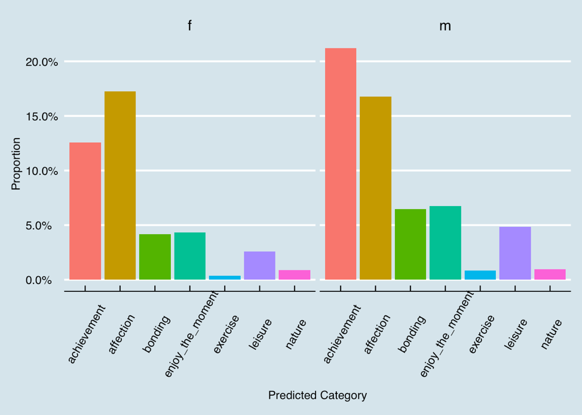
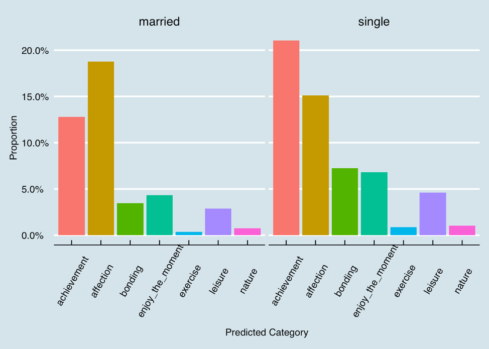

# Applied Data Science @ Columbia
## Spring 2019
## Project 1: What made you happy today?

Name: Yun Zhang
UNI: yz3384

+ Project summary: 
1. Wordcloud
+ People mention work, friend ,family, home most, then followed by daughter, son, dinner and birthday.

2. Basic analysis
· Number of words distribution
+ Most people say less than 15 words. And when the number of the words increases, the number of people decreases.

· Agestage distribution
+ Young adults account for the main part, followed by teenagers and middle aged. The old aged poeple are the least.

· Emotion analysis
+ The expressions of people are most related to joy, anticipation and trust. Although the topic of sentences people speak is happiness, there are still negative related words which express fear, sadness, disgust and anger.

· Most five happiness moments of people at each agestage
+ Young adults and teenagers both mention work, friend, family and home most. But the difference is that young adults aslo consider night creates happiness more while teenagers like birthday more. In addition, middle aged and old aged both mention daughter, son and friend much. However, middle aged people like work best while old aged love wife more.

3. Analysis about predicted category with other variables
· Predict category & agestage
+ Teenagers, young adults and middle aged people all like achievement and affection most, but young adults have stronger feelings about that.

· Predict category & gender
+ Female and male both like talking about affection. However, male prefer to discuss achievenment more than affection and female are the opposite.

· Predict category & marital
+ Married people and single people both like achievement and affection most. However, married people prefer affection better while single people prefer achievement more. In addition, the remaining components of predict category are only small parts of happiness. But single people think bonding, enjoying the moment and leisure more than married people.

· Predict category & reflection period
+ From the graphic above, there does not exist great differences between reflection period of 24 hours and 3 months. People in two groups all like achievement and affection more. The small difference is that people with 3 months reflection period are more likely to consider achievement and affection as the happiest moment. In contrast, people with one day reflection period think enjoying the moment and leisure matter more than people have 3 months reflection period.

· Prediction category & parenthood
+ People who have children like to discuss about affection most, but people without children like achievement more than affection.

